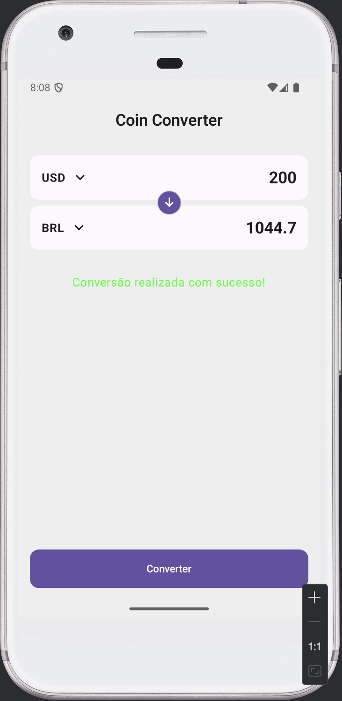

# 💰 CoinConverter

Aplicativo Android para conversão de moedas em tempo real (Real, Dólar e Euro) utilizando dados atualizados de câmbio através da API **ExchangeRate**.

---

## 📱 Sobre o projeto

O **CoinConverter** é um app mobile desenvolvido em **Kotlin** que permite converter valores entre moedas de forma rápida e simples.
Ele consome dados de cotação em tempo real por meio de requisições HTTP utilizando **Ktor Client** e segue o padrão de arquitetura **MVVM**, garantindo organização, escalabilidade e facilidade de manutenção.

---

## Telas




---

## Funcionalidades

* Conversão entre **BRL, USD e EUR**
* Atualização de cotação em tempo real
* Interface moderna com **Jetpack Compose**
* Arquitetura limpa baseada em MVVM
* Injeção de dependência com **Hilt**
* Configuração segura de API Key

---

## Tecnologias e Bibliotecas

### Linguagem

* Kotlin

### UI

* Jetpack Compose
* Material 3

### Arquitetura

* MVVM (Model — View — ViewModel)

### Networking

* Ktor Client

  * okhttp engine
  * logging
  * content negotiation
  * kotlinx serialization json

### DI (Injeção de Dependência)

* Hilt + KSP

### Build

* Gradle Version Catalog
* Kotlin Serialization Plugin

---

## Configuração da API Key

O projeto lê a chave da API a partir do arquivo:

```
local.properties
```

Adicione sua chave:

```
API_KEY=SUA_CHAVE_AQUI
```

Ela é injetada no BuildConfig automaticamente:

```kotlin
buildConfigField("String", "API_KEY", "\"$apiKey\"")
```

---

## Como rodar o projeto

### Pré-requisitos

* Android Studio atualizado
* SDK 24+
* JDK 8+

### Passos

1. Clone o repositório
2. Crie o arquivo `local.properties` com sua API Key
3. Abra no Android Studio
4. Rode o projeto

---
